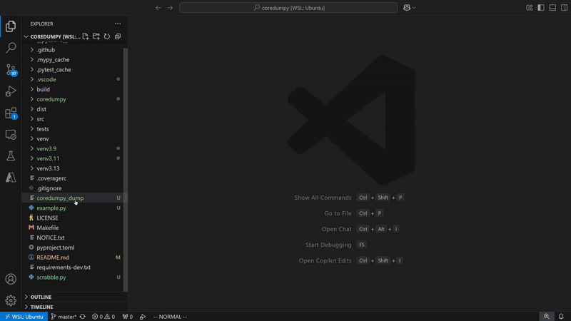

# coredumpy

[](https://github.com/gaogaotiantian/coredumpy/actions/workflows/build_test.yaml)
[](https://codecov.io/gh/gaogaotiantian/coredumpy)
[](https://pypi.org/project/coredumpy/)
[](https://img.shields.io/pypi/pyversions/coredumpy)
[](https://marketplace.visualstudio.com/items?itemName=gaogaotiantian.coredumpy-vscode)
[](https://github.com/sponsors/gaogaotiantian)

coredumpy saves your crash site for post-mortem debugging.

<p align="center">
    
</p>


## Highlights

* Easy to use
* Native support for unittest, pytest and run-time exceptions
* Portable and safe dump
* Support VSCode and pdb interface
* Support multi-threading with VSCode

## Usage

### dump

For `pytest`, you can use `coredumpy` as a plugin

```
# Create a dump in "./dumps" when there's a pytest failure/error
pytest --enable-coredumpy --coredumpy-dir ./dumps
```

For `Exception` and `unittest`, you can use `coredumpy run` command.
A dump will be generated when there's an unhandled exception or a test failure

```
# with no argument coredumpy run will generate the dump in the current dir
coredumpy run my_script.py
coredumpy run my_script.py --directory ./dumps
coredumpy run -m unittest --directory ./dumps
```

Or you can patch explicitly in your code and execute the script/module as usual

```python
import coredumpy
# Create a dump in "./dumps" when there's an unhandled exception
coredumpy.patch_except(directory='./dumps')
# Create a dump in "./dumps" only when exceptions other than KeyboardInterrupt occur
coredumpy.patch_except(directory="./dumps", exclude=[KeyboardInterrupt])
# Create a dump in "./dumps" when there's a unittest failure/error
coredumpy.patch_unittest(directory='./dumps')
# Create a dump in "./dumps" when there's a pytest failure/error
coredumpy.patch_pytest(directory='./dumps')
```

<details>

<summary>
Or you can dump the current frame stack manually
</summary>

```python
import coredumpy

# Without frame argument, top frame will be the caller of coredumpy.dump()
coredumpy.dump()
# Specify a specific frame as the top frame to dump
coredumpy.dump(frame)
# Set the search depth to 2 to reduce the dump size
coredumpy.dump(depth=2)
# Specify a filename to save the dump, without it a unique name will be generated
coredumpy.dump(path='coredumpy.dump')
# You can use a function for path
coredumpy.dump(path=lambda: f"coredumpy_{time.time()}.dump")
# Specify a directory to keep the dump
coredumpy.dump(directory='./dumps')
# Specify the description of the dump for peek
coredumpy.dump(description="a random dump")
```

</details>

A [github action](https://github.com/gaogaotiantian/upload-coredumpy) is available
to upload your coredumpy dumps and generate a load link to open the dumps in VSCode
directly.

### load

Load your dump with

```
# This will bring up pdb
coredumpy load <your_dump_file>
# This will bring up ipdb, ipython is required
coredumpy load --ipdb <your_dump_file>
```

A debugger will be brought up and of course not everything is supported.

### peek

If you only need some very basic information of the dump (to figure out which dump
you actually need), you can use `peek` command.

```
coredumpy peek <your_dump_directory>
coredumpy peek <your_dump_file1> <your_dump_file2>
```

### VSCode Extension

Download the [VSCode Extension](https://marketplace.visualstudio.com/items?itemName=gaogaotiantian.coredumpy-vscode)
and right click your dump file - choose `Load with coredumpy`.

### Configuration

All configurations should be done through `coredumpy.config`.
The default value is listed below and you can change them as you need.

```python
from coredumpy import config
# The dump depth if not specified
config.default_recursion_depth: int = 10
# Best effort timeout for dump - not guaranteed. Only checked for each new depth.
config.dump_timeout: int = 60
# Whether dump all threads
config.dump_all_threads: bool = True
# Whether hide strings that match config.secret_patterns
config.hide_secret: bool = True
# The patterns for secrets
config.secret_patterns: list[re.Pattern] = [re.compile(r"[A-Za-z0-9]{32,1024}")]
# Whether hide strings that match os.environ.values()
config.hide_environ: bool = True
# The filter to determine whether an environ should be hidden
config.environ_filter: Callable = lambda env: len(env) > 8
```

## Type support

`coredumpy` supports the common built-in types like `float`, `int`, `str`, `list`,
`dict` etc. For all the other types that it can't recognize, it will treat them as
a Python object, which means `coredumpy` will iterate and store all the attributes
of the object.

You can add support for any arbitrary types by creating a class that inherits
`coredumpy.TypeSupportBase`. You need to finish the following class methods in
order to make it work:

```python
@classmethod
def get_type(cls) -> tuple[Union[type, Callable], str]:
    # returns a tuple with two elements:
    # 0. type (or a callable for lazy load) for dump
    #    coredumpy will dispatch the objects with this type to the dump method
    # 1. a type string for load
    #    coredumpy will dispatch the data with this type to the load method

@classmethod
def dump(cls, obj) -> tuple[dict, Optional[list]]:
    # takes the object to be dumped
    # returns a tuple with two elements:
    # 0. a json-serializable dict, which will be stored in the dump file
    # 1. a list that contains the objects needed to be dumped for this object
    #    if none needed (the object is not a container), use None

@classmethod
def load(cls, data: dict, objects: dict) -> tuple[object, Optional[list[str]]]:
    # takes the dict data from `dump` method and a dict of all objects with the ids
    # as keys
    # returns a tuple with two elements:
    # 0. the restored object. If not ready, return coredumpy.NotReady
    # 1. a list of the ids of dependent objects, if not applicable, use None
```

If the type is a container, inherit `coredumpy.TypeSupportContainerBase` and
implement an extra method:

```python
@classmethod
def reload(cls, container, data, objects: dict) -> tuple[object, Optional[list[str]]]:
    # takes the already built container, the other arguments are the same as `load`
    # returns the same as `load`
    # This is helpful to create a placeholder first with `load` so the other objects
    # can reference to it, and build the placeholder later
```

You only need to create the class, it will be automatically registered.

## Startup script

In order to import the type supports and do some customization, `coredumpy` provides
a way to run an arbitrary script after importing `coredumpy`. You can put a
`conf_coredumpy.py` file in your current working directory. If `coredumpy` discovers
it, the script will be executed. You can put anything you need in the script.

Or if you prefer to do it explicitly, you can pass `--conf your_conf_file.py` to
`coredumpy run` or `coredumpy load` command to run that specified file.

## About the data

Besides a couple of builtin types, coredumpy treats almost every object as an
Python object with attributes, and that's what it records in the dump.

That being said, most of the objects will not be "restored" as they were when
being dumped. You are in an observer mode where you can inspect attributes of
all objects. None of the methods of the objects would work, nor would any
dynamic features.

### Why not `pickle`?

* Most importantly, `pickle` does not always work. You can't partially pickle
  something, which means if you have an unpickleable object, you are doomed.
* `pickle` requires the same environment to deserialize the objects, which
  defeats the original purpose of loading the dump anywhere.
* `pickle` is unsafe by design and we don't want unnecessary hesitation when
  users try to load a dump from an untrusted source.

### Security concerns

Because coredumpy dumps the whole frame stack, you should take care of your
sensitive information.

#### API Keys

coredumpy has a default-on filter for strings that looks like API keys
(`"[A-Za-z0-9]{32,1024}"`), but if you know what your key looks like,
you should add the pattern to protect your keys.

```python
from coredumpy import config
config.secret_patterns.append(re.compile("<your API key pattern>"))
```

You can edit `config.secret_patterns` as you wish, it's a list of
`re.Pattern`s that coredumpy will use to match against all strings.

If you need to turn off this feature:

```python
from coredumpy import config
config.hide_secret = False
```

#### Environs

It's common to store sensitive data in your environment variables, so coredumpy
also has a default-on filter for environs. It will redact all strings if they
are in `os.environ` and their length > 8. You can change the filter by

```python
from coredumpy import config
# Only redact if the length > 16
config.environ_filter = lambda env: len(env) > 16
```

Turn this filter off with
```python
from coredumpy import config
config.hide_environ = False
```


## License

Copyright 2024-2026 Tian Gao.

Distributed under the terms of the  [Apache 2.0 license](https://github.com/gaogaotiantian/coredumpy/blob/master/LICENSE).
